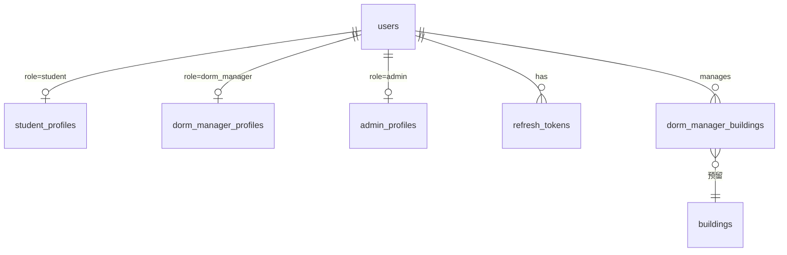

# 用户管理 — 数据库表结构

推荐 **MySQL 8.0+**，字符集 `utf8mb4`，排序规则 `utf8mb4_unicode_ci`。

## ER 关系



---

## 1. 用户主表 `users`

所有角色共用，负责认证与账号状态。

```sql
CREATE TABLE users (
    id              BIGINT PRIMARY KEY AUTO_INCREMENT,
    username        VARCHAR(50)  NOT NULL UNIQUE COMMENT '登录名，学号/工号/管理员账号',
    password_hash   VARCHAR(255) NOT NULL COMMENT 'bcrypt 哈希',
    role            ENUM('admin', 'student', 'dorm_manager') NOT NULL,
    real_name       VARCHAR(50)  NOT NULL COMMENT '真实姓名',
    phone           VARCHAR(20)  NULL,
    email           VARCHAR(100) NULL,
    avatar_url      VARCHAR(255) NULL,
    status          TINYINT      NOT NULL DEFAULT 1 COMMENT '1=正常 0=禁用',
    last_login_at   DATETIME     NULL,
    created_at      DATETIME     NOT NULL DEFAULT CURRENT_TIMESTAMP,
    updated_at      DATETIME     NOT NULL DEFAULT CURRENT_TIMESTAMP ON UPDATE CURRENT_TIMESTAMP,
    deleted_at      DATETIME     NULL COMMENT '软删除',

    INDEX idx_role (role),
    INDEX idx_status (status),
    INDEX idx_real_name (real_name)
) COMMENT='用户主表';
```

| 字段 | 说明 |
|------|------|
| `username` | 登录账号，可与学号/工号相同 |
| `password_hash` | 仅存 bcrypt 哈希，禁止明文 |
| `role` | 用户角色，决定关联哪张扩展表 |
| `status` | 1 正常 / 0 禁用 |
| `deleted_at` | 软删除时间戳，NULL 表示未删除 |

---

## 2. 学生扩展表 `student_profiles`

```sql
CREATE TABLE student_profiles (
    id                  BIGINT PRIMARY KEY AUTO_INCREMENT,
    user_id             BIGINT       NOT NULL UNIQUE,
    student_no          VARCHAR(30)  NOT NULL UNIQUE COMMENT '学号',
    gender              ENUM('male', 'female', 'other') NULL,
    college             VARCHAR(100) NULL COMMENT '学院',
    major               VARCHAR(100) NULL COMMENT '专业',
    grade               VARCHAR(20)  NULL COMMENT '年级，如 2023',
    class_name          VARCHAR(50)  NULL COMMENT '班级',
    id_card             VARCHAR(18)  NULL COMMENT '身份证号（建议加密存储）',
    emergency_contact   VARCHAR(50)  NULL COMMENT '紧急联系人',
    emergency_phone     VARCHAR(20)  NULL COMMENT '紧急联系电话',
    created_at          DATETIME NOT NULL DEFAULT CURRENT_TIMESTAMP,
    updated_at          DATETIME NOT NULL DEFAULT CURRENT_TIMESTAMP ON UPDATE CURRENT_TIMESTAMP,

    CONSTRAINT fk_student_user FOREIGN KEY (user_id) REFERENCES users(id),
    INDEX idx_student_no (student_no),
    INDEX idx_college_grade (college, grade)
) COMMENT='学生扩展信息';
```

---

## 3. 宿管扩展表 `dorm_manager_profiles`

```sql
CREATE TABLE dorm_manager_profiles (
    id              BIGINT PRIMARY KEY AUTO_INCREMENT,
    user_id         BIGINT       NOT NULL UNIQUE,
    employee_no     VARCHAR(30)  NOT NULL UNIQUE COMMENT '工号',
    gender          ENUM('male', 'female', 'other') NULL,
    hire_date       DATE         NULL COMMENT '入职日期',
    remark          VARCHAR(255) NULL,
    created_at      DATETIME NOT NULL DEFAULT CURRENT_TIMESTAMP,
    updated_at      DATETIME NOT NULL DEFAULT CURRENT_TIMESTAMP ON UPDATE CURRENT_TIMESTAMP,

    CONSTRAINT fk_manager_user FOREIGN KEY (user_id) REFERENCES users(id),
    INDEX idx_employee_no (employee_no)
) COMMENT='宿管扩展信息';
```

---

## 4. 管理员扩展表 `admin_profiles`

便于区分普通管理员与超级管理员，后续可扩展部门、权限范围。

```sql
CREATE TABLE admin_profiles (
    id              BIGINT PRIMARY KEY AUTO_INCREMENT,
    user_id         BIGINT       NOT NULL UNIQUE,
    admin_level     TINYINT      NOT NULL DEFAULT 1 COMMENT '1=普通管理员 9=超级管理员',
    department      VARCHAR(100) NULL COMMENT '所属部门',
    created_at      DATETIME NOT NULL DEFAULT CURRENT_TIMESTAMP,
    updated_at      DATETIME NOT NULL DEFAULT CURRENT_TIMESTAMP ON UPDATE CURRENT_TIMESTAMP,

    CONSTRAINT fk_admin_user FOREIGN KEY (user_id) REFERENCES users(id)
) COMMENT='管理员扩展信息';
```

---

## 5. 宿管-楼栋关联表 `dorm_manager_buildings`（预留）

宿管通常负责一个或多个楼栋。用户管理阶段可先建表，等宿舍模块完成后再启用外键。

```sql
CREATE TABLE dorm_manager_buildings (
    id              BIGINT PRIMARY KEY AUTO_INCREMENT,
    manager_user_id BIGINT NOT NULL,
    building_id     BIGINT NOT NULL COMMENT '关联 buildings 表，后续模块创建',
    assigned_at     DATETIME NOT NULL DEFAULT CURRENT_TIMESTAMP,

    UNIQUE KEY uk_manager_building (manager_user_id, building_id),
    CONSTRAINT fk_dmb_manager FOREIGN KEY (manager_user_id) REFERENCES users(id)
) COMMENT='宿管负责楼栋';
```

---

## 6. 刷新 Token 表 `refresh_tokens`

JWT + Refresh Token 方案使用，支持注销时吊销 Token。

```sql
CREATE TABLE refresh_tokens (
    id              BIGINT PRIMARY KEY AUTO_INCREMENT,
    user_id         BIGINT       NOT NULL,
    token_hash      VARCHAR(255) NOT NULL UNIQUE,
    expires_at      DATETIME     NOT NULL,
    revoked_at      DATETIME     NULL,
    created_at      DATETIME     NOT NULL DEFAULT CURRENT_TIMESTAMP,

    INDEX idx_user_id (user_id),
    CONSTRAINT fk_rt_user FOREIGN KEY (user_id) REFERENCES users(id)
) COMMENT='Refresh Token';
```

---

## 字段枚举说明

### users.role

| 值 | 含义 |
|----|------|
| `admin` | 管理员 |
| `student` | 学生 |
| `dorm_manager` | 宿管阿姨 |

### gender（student_profiles / dorm_manager_profiles）

| 值 | 含义 |
|----|------|
| `male` | 男 |
| `female` | 女 |
| `other` | 其他 |

### users.status

| 值 | 含义 |
|----|------|
| `1` | 正常 |
| `0` | 禁用 |

### admin_profiles.admin_level

| 值 | 含义 |
|----|------|
| `1` | 普通管理员 |
| `9` | 超级管理员 |

---

## 初始化脚本示例

首次部署需创建超级管理员（密码应在应用层 bcrypt 哈希后写入）：

```sql
-- 示例：创建超级管理员（password_hash 需替换为实际 bcrypt 值）
INSERT INTO users (username, password_hash, role, real_name, status)
VALUES ('admin', '$2b$12$...', 'admin', '系统管理员', 1);

INSERT INTO admin_profiles (user_id, admin_level, department)
VALUES (LAST_INSERT_ID(), 9, '学生处');
```
